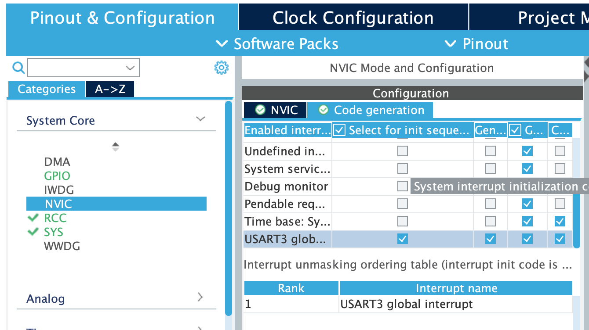

# 4강 UART 통신


NVIC 설정 

USART3 global interrupt - enable


Code generation

USART3 global interrupt Select for init sequence ordering - enable



``` cpp
/* USER CODE BEGIN Header */
/**
  ******************************************************************************
  * @file           : main.c
  * @brief          : Main program body
  ******************************************************************************
  * @attention
  *
  * Copyright (c) 2022 STMicroelectronics.
  * All rights reserved.
  *
  * This software is licensed under terms that can be found in the LICENSE file
  * in the root directory of this software component.
  * If no LICENSE file comes with this software, it is provided AS-IS.
  *
  ******************************************************************************
  */
/* USER CODE END Header */
/* Includes ------------------------------------------------------------------*/
#include "main.h"

/* Private includes ----------------------------------------------------------*/
/* USER CODE BEGIN Includes */

/* USER CODE END Includes */

/* Private typedef -----------------------------------------------------------*/
/* USER CODE BEGIN PTD */

/* USER CODE END PTD */

/* Private define ------------------------------------------------------------*/
/* USER CODE BEGIN PD */
/* USER CODE END PD */

/* Private macro -------------------------------------------------------------*/
/* USER CODE BEGIN PM */

/* USER CODE END PM */

/* Private variables ---------------------------------------------------------*/
 UART_HandleTypeDef huart3;

/* USER CODE BEGIN PV */
// uint8_t rx3_data;	
uint8_t rx3_data[10];	// 10바이트 받으면 인터럽트 출력을 위한 배열
/* USER CODE END PV */

/* Private function prototypes -----------------------------------------------*/
void SystemClock_Config(void);
static void MX_GPIO_Init(void);
static void MX_USART3_UART_Init(void);
static void MX_NVIC_Init(void);
/* USER CODE BEGIN PFP */

/* USER CODE END PFP */

/* Private user code ---------------------------------------------------------*/
/* USER CODE BEGIN 0 */

/* USER CODE END 0 */

/**
  * @brief  The application entry point.
  * @retval int
  */
int main(void)
{
  /* USER CODE BEGIN 1 */

  /* USER CODE END 1 */

  /* MCU Configuration--------------------------------------------------------*/

  /* Reset of all peripherals, Initializes the Flash interface and the Systick. */
  HAL_Init();

  /* USER CODE BEGIN Init */

  /* USER CODE END Init */

  /* Configure the system clock */
  SystemClock_Config();

  /* USER CODE BEGIN SysInit */

  /* USER CODE END SysInit */

  /* Initialize all configured peripherals */
  MX_GPIO_Init();
  MX_USART3_UART_Init();

  /* Initialize interrupts */
  MX_NVIC_Init();	// 인터럽트 초기화 정의
  /* USER CODE BEGIN 2 */
  
  // rx3_data에 한바이트 수신이 이뤄지면 인터럽트 호출
  // HAL_UART_Receive_IT(&huart3, &rx3_data, 1);
  HAL_UART_Receive_IT(&huart3, rx3_data, 10);	
  /* USER CODE END 2 */

  /* Infinite loop */
  /* USER CODE BEGIN WHILE */
  while (1)
  {
    /* USER CODE END WHILE */

    /* USER CODE BEGIN 3 */
  }
  /* USER CODE END 3 */
}

/**
  * @brief System Clock Configuration
  * @retval None
  */
void SystemClock_Config(void)
{
  RCC_OscInitTypeDef RCC_OscInitStruct = {0};
  RCC_ClkInitTypeDef RCC_ClkInitStruct = {0};

  /** Configure the main internal regulator output voltage
  */
  __HAL_RCC_PWR_CLK_ENABLE();
  __HAL_PWR_VOLTAGESCALING_CONFIG(PWR_REGULATOR_VOLTAGE_SCALE1);

  /** Initializes the RCC Oscillators according to the specified parameters
  * in the RCC_OscInitTypeDef structure.
  */
  RCC_OscInitStruct.OscillatorType = RCC_OSCILLATORTYPE_HSE;
  RCC_OscInitStruct.HSEState = RCC_HSE_ON;
  RCC_OscInitStruct.PLL.PLLState = RCC_PLL_ON;
  RCC_OscInitStruct.PLL.PLLSource = RCC_PLLSOURCE_HSE;
  RCC_OscInitStruct.PLL.PLLM = 4;
  RCC_OscInitStruct.PLL.PLLN = 168;
  RCC_OscInitStruct.PLL.PLLP = RCC_PLLP_DIV2;
  RCC_OscInitStruct.PLL.PLLQ = 4;
  if (HAL_RCC_OscConfig(&RCC_OscInitStruct) != HAL_OK)
  {
    Error_Handler();
  }

  /** Initializes the CPU, AHB and APB buses clocks
  */
  RCC_ClkInitStruct.ClockType = RCC_CLOCKTYPE_HCLK|RCC_CLOCKTYPE_SYSCLK
                              |RCC_CLOCKTYPE_PCLK1|RCC_CLOCKTYPE_PCLK2;
  RCC_ClkInitStruct.SYSCLKSource = RCC_SYSCLKSOURCE_PLLCLK;
  RCC_ClkInitStruct.AHBCLKDivider = RCC_SYSCLK_DIV1;
  RCC_ClkInitStruct.APB1CLKDivider = RCC_HCLK_DIV4;
  RCC_ClkInitStruct.APB2CLKDivider = RCC_HCLK_DIV2;

  if (HAL_RCC_ClockConfig(&RCC_ClkInitStruct, FLASH_LATENCY_5) != HAL_OK)   
  {
    Error_Handler();
  }
}

/**
  * @brief NVIC Configuration.
  * @retval None
  */
static void MX_NVIC_Init(void)
{
  /* USART3_IRQn interrupt configuration */
  HAL_NVIC_SetPriority(USART3_IRQn, 0, 0);
  HAL_NVIC_EnableIRQ(USART3_IRQn);
}

/**
  * @brief USART3 Initialization Function
  * @param None
  * @retval None
  */
static void MX_USART3_UART_Init(void)
{

  /* USER CODE BEGIN USART3_Init 0 */

  /* USER CODE END USART3_Init 0 */

  /* USER CODE BEGIN USART3_Init 1 */

  /* USER CODE END USART3_Init 1 */
  huart3.Instance = USART3;
  huart3.Init.BaudRate = 115200;
  huart3.Init.WordLength = UART_WORDLENGTH_8B;
  huart3.Init.StopBits = UART_STOPBITS_1;
  huart3.Init.Parity = UART_PARITY_NONE;
  huart3.Init.Mode = UART_MODE_TX_RX;
  huart3.Init.HwFlowCtl = UART_HWCONTROL_NONE;
  huart3.Init.OverSampling = UART_OVERSAMPLING_16;
  if (HAL_UART_Init(&huart3) != HAL_OK)
  {
    Error_Handler();
  }
  /* USER CODE BEGIN USART3_Init 2 */

  /* USER CODE END USART3_Init 2 */

}

/**
  * @brief GPIO Initialization Function
  * @param None
  * @retval None
  */
static void MX_GPIO_Init(void)
{

  /* GPIO Ports Clock Enable */
  __HAL_RCC_GPIOH_CLK_ENABLE();
  __HAL_RCC_GPIOD_CLK_ENABLE();

}

/* USER CODE BEGIN 4 */
/**
__weak : 
__weak void HAL_UART_RxCpltCallback(UART_HandleTypeDef *huart)
{
	UNUSED(huart);
}

`__weak` 앞에 붙는 이 키워드는 C 또는 C++ 프로그래밍 언어에서 사용되며, 특히 임베디드 시스템 프로그래밍에서 자주 보게 됩니다. `__weak` 키워드는 함수나 변수에 대해 "약한(weak)" 바인딩을 제공합니다. 이는 다음과 같은 의미를 가집니다:

1. **재정의(Overriding) 용이**: `__weak`으로 선언된 함수는 사용자가 필요에 따라 새롭게 정의할 수 있습니다. 즉, 기본적으로 제공되는 함수의 구현이 있지만, 사용자가 같은 이름의 함수를 새롭게 정의하면, 사용자의 정의가 우선 적용됩니다.

2. **링커 동작**: 링커는 `__weak`으로 선언된 심볼과 일반 심볼 간의 충돌을 다룰 때 일반 심볼을 우선시 합니다. 즉, 동일한 이름의 일반 심볼과 `__weak` 심볼이 있을 경우, `__weak` 심볼은 무시되고 일반 심볼이 사용됩니다.

3. **라이브러리 및 재사용성**: 임베디드 시스템에서는 종종 특정 하드웨어에 특화된 라이브러리를 사용합니다. `__weak` 키워드를 사용함으로써, 라이브러리 제공자는 기본적인 구현을 제공할 수 있고, 라이브러리 사용자는 자신의 요구에 맞게 이를 쉽게 재정의할 수 있습니다.

예를 들어, `HAL_UART_RxCpltCallback` 함수에서 `__weak` 키워드가 사용된다면, 이는 STM32 하드웨어 추상화 레이어(HAL)에서 제공하는 기본 UART 수신 완료 콜백 함수입니다. 사용자는 필요에 따라 이 함수를 자신의 애플리케이션에 맞게 재정의할 수 있습니다. 기본 함수는 사용자의 정의가 없는 경우에만 호출됩니다.
**/


void HAL_UART_RxCpltCallback(UART_HandleTypeDef *huart)
{
	if(huart->Instance == USART3)
	{
		// HAL_UART_Receive_IT(&huart3, &rx3_data, 1);
		// HAL_UART_Transmit(&huart3, &rx3_data, 1, 10);
		
		HAL_UART_Receive_IT(&huart3, &rx3_data, 10);
		HAL_UART_Transmit(&huart3, &rx3_data, 10, 10);
		rx3_data[0] = '\0';
	}
}
/* USER CODE END 4 */

/**
  * @brief  This function is executed in case of error occurrence.
  * @retval None
  */
void Error_Handler(void)
{
  /* USER CODE BEGIN Error_Handler_Debug */
  /* User can add his own implementation to report the HAL error return state */
  __disable_irq();
  while (1)
  {
  }
  /* USER CODE END Error_Handler_Debug */
}

#ifdef  USE_FULL_ASSERT
/**
  * @brief  Reports the name of the source file and the source line number
  *         where the assert_param error has occurred.
  * @param  file: pointer to the source file name
  * @param  line: assert_param error line source number
  * @retval None
  */
void assert_failed(uint8_t *file, uint32_t line)
{
  /* USER CODE BEGIN 6 */
  /* User can add his own implementation to report the file name and line number,
     ex: printf("Wrong parameters value: file %s on line %d\r\n", file, line) */
  /* USER CODE END 6 */
}
#endif /* USE_FULL_ASSERT */

```